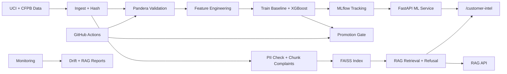

# Customer Intelligence Platform

An end-to-end MLOps and LLMOps mini-project for IIT Gandhinagar Week 13. The platform predicts whether a bank marketing customer is likely to subscribe to a term deposit, retrieves evidence from consumer complaint records, and combines both signals into one integrated customer-intelligence response.

The project is designed to demonstrate a production-style spine rather than a notebook-only prototype: reproducible data ingestion, Pandera validation, reusable feature engineering, MLflow experiment tracking, promotion gates, FastAPI serving, FAISS retrieval, RAG evaluation, monitoring, Docker Compose, and GitHub Actions CI/CD.

## What This Project Does

The system has two services and one integrated workflow:

1. **ML service: Campaign Conversion Prediction**
   - Uses the UCI Bank Marketing dataset.
   - Trains a baseline Logistic Regression model and an improved XGBoost model.
   - Tracks metrics, models, preprocessing artifacts, feature importance, and calibration plots in MLflow.
   - Serves predictions through FastAPI.

2. **RAG service: Complaint Intelligence**
   - Uses a 5,000-record sample from the CFPB Consumer Complaint Database.
   - Removes high-risk PII fields before indexing.
   - Chunks complaint narratives, embeds them, stores them in FAISS, and retrieves cited evidence.
   - Includes refusal behavior for weak, vague, or unsafe questions.

3. **Integrated endpoint: Customer Intelligence**
   - Accepts customer features plus optional complaint filters.
   - Returns conversion probability, conversion band, top complaint themes, and cited complaint record IDs.

## Architecture



Full architecture notes are in `docs/architecture.md`.

## Tech Stack

| Area | Technology |
|---|---|
| Language | Python 3.10 target, tested locally on Python 3.12 |
| API | FastAPI 0.111, Uvicorn 0.29 |
| ML | scikit-learn 1.4, XGBoost 2.0 |
| Tracking | MLflow 2.13 |
| Validation | Pandera 0.19, Pydantic v2 |
| RAG/Retrieval | FAISS 1.8, sentence-transformers 2.7 with local hashing fallback |
| Monitoring | Evidently 0.4, custom RAG JSONL monitoring |
| Testing | pytest 8 |
| Containers | Docker, Docker Compose |
| CI/CD | GitHub Actions |
| Cloud Target | GCP Cloud Run free-tier settings, optional |

## Repository Structure

```text
customer-intelligence-platform/
|-- data/                    # Source links and local-only generated data
|-- src/
|   |-- data_pipeline/       # Ingestion, validation, feature engineering
|   |-- training/            # Training, evaluation, promotion gate
|   |-- serving/             # FastAPI ML + integration API
|   `-- rag/                 # FAISS index, retrieval, RAG API, RAG eval
|-- tests/                   # Feature, schema, API, retrieval tests
|-- .github/workflows/       # CI and model evaluation gate
|-- monitoring/              # ML drift and RAG monitoring scripts
|-- docs/                    # Architecture, decisions, demo, evidence, reports
|-- Dockerfile
|-- docker-compose.yml
|-- requirements.txt
|-- reflection.md
`-- README.md
```

## Prerequisites

- Python 3.10 recommended.
- Docker Desktop, if running containers.
- Git.
- Optional: GCP CLI if deploying to Cloud Run.

If using PowerShell on Windows, run commands from:

```powershell
C:\Users\Sharanya Naresh\Documents\Mini Project Week 13\customer-intelligence-platform
```

## Fresh Setup From Clone

```powershell
git clone <your-public-github-repo-url>
cd customer-intelligence-platform
python -m venv .venv
.\.venv\Scripts\Activate.ps1
pip install -r requirements.txt
python src\data_pipeline\ingest.py --sample 5000
```

Then validate:

```powershell
python src\data_pipeline\validate.py
```

Expected:

```text
Validation passed - 45208 rows, 17 columns.
```

## Run The Full Project Locally

### 1. Ingest and Validate Data

```powershell
python src\data_pipeline\ingest.py --sample 5000
python src\data_pipeline\validate.py
```

Outputs:

- `data/bank_marketing.csv`
- `data/cfpb_complaints_sample.csv`
- `data/uci_hash.txt`
- `data/cfpb_hash.txt`

Raw data is ignored by Git.

### 2. Train Models and Log to MLflow

```powershell
python src\training\train.py
```

Expected:

```text
Training baseline and improved models with MLflow tracking...
baseline | run_id=<id> | roc_auc=<number> | pr_auc=<number> | f1=<number>
improved | run_id=<id> | roc_auc=<number> | pr_auc=<number> | f1=<number>
Training complete. PR-AUC delta=<number>, F1 delta=<number>.
```

Open MLflow:

```powershell
mlflow ui
```

Then open:

```text
http://127.0.0.1:5000
```

### 3. Run The Promotion Gate

```powershell
python src\training\evaluate.py
```

Expected:

- `✅ PROMOTED` for the real improved model.
- `🚫 BLOCKED` for the intentionally degraded model.

CI mode:

```powershell
python src\training\evaluate.py --mode gate
```

### 4. Build The Complaint FAISS Index

```powershell
python src\rag\build_index.py
```

Expected:

```text
PII CHECK: loading only safe metadata columns and sanitized complaint narratives.
total_chunks=<number> | embedding_time_seconds=<number> | index_file_size_bytes=<number>
```

Note: The script tries `sentence-transformers/all-MiniLM-L6-v2` first. If Torch cannot load locally, it falls back to a deterministic local `HashingVectorizer` so the FAISS retrieval pipeline still works without paid APIs.

### 5. Start The ML API

Terminal 1:

```powershell
python -m uvicorn src.serving.serve:app --host 127.0.0.1 --port 8000
```

Terminal 2:

```powershell
curl.exe http://127.0.0.1:8000/health
```

### 6. Start The RAG API

Terminal 3:

```powershell
python -m uvicorn src.rag.answer:app --host 127.0.0.1 --port 8001
```

Terminal 2:

```powershell
$body = @{ question = "What themes appear around debt not owed?" } | ConvertTo-Json
Invoke-RestMethod -Uri "http://127.0.0.1:8001/ask-complaints" -Method Post -ContentType "application/json" -Body $body
```

### 7. Run Tests

```powershell
python -m pytest tests\ -q
```

Expected:

```text
14 passed
```

### 8. Generate Monitoring Reports

```powershell
python monitoring\ml_drift.py
python monitoring\rag_monitor.py
```

Outputs:

- `monitoring/ml_drift_report.html`
- `monitoring/rag_monitoring_report.json`

## Docker Compose

This machine uses the legacy Docker Compose command:

```powershell
docker-compose up --build -d
docker-compose ps
curl.exe http://127.0.0.1:8000/health
curl.exe http://127.0.0.1:8001/health
```

Stop services:

```powershell
docker-compose down
```

## Endpoint Reference

| Service | Method | Endpoint | Purpose |
|---|---:|---|---|
| ML API | GET | `/health` | Service health, model version, index version, uptime. |
| ML API | POST | `/predict` | Predicts one customer's conversion probability. |
| ML API | POST | `/batch-score` | Scores multiple customers and returns low/medium/high bands. |
| ML API | GET | `/metrics` | Returns in-memory latency, errors, request count, prediction distribution. |
| RAG API | GET | `/health` | RAG service and index health. |
| RAG API | POST | `/ask-complaints` | Answers complaint questions using retrieved evidence and citations. |
| Integrated API | POST | `/customer-intel` | Combines ML score with top complaint themes and cited complaint IDs. |

## Example API Calls

### Predict

```powershell
curl.exe -X POST http://127.0.0.1:8000/predict -H "Content-Type: application/json" -d "{\"age\":42,\"job\":\"management\",\"marital\":\"married\",\"education\":\"tertiary\",\"default\":\"no\",\"balance\":1200,\"housing\":\"yes\",\"loan\":\"no\",\"contact\":\"cellular\",\"day\":15,\"month\":\"may\",\"duration\":180,\"campaign\":2,\"pdays\":-1,\"previous\":0,\"poutcome\":\"unknown\"}"
```

### Batch Score

```powershell
curl.exe -X POST http://127.0.0.1:8000/batch-score -H "Content-Type: application/json" -d "{\"records\":[{\"age\":42,\"job\":\"management\",\"marital\":\"married\",\"education\":\"tertiary\",\"default\":\"no\",\"balance\":1200,\"housing\":\"yes\",\"loan\":\"no\",\"contact\":\"cellular\",\"day\":15,\"month\":\"may\",\"duration\":180,\"campaign\":2,\"pdays\":-1,\"previous\":0,\"poutcome\":\"unknown\"},{\"age\":29,\"job\":\"technician\",\"marital\":\"single\",\"education\":\"secondary\",\"default\":\"no\",\"balance\":500,\"housing\":\"no\",\"loan\":\"no\",\"contact\":\"cellular\",\"day\":10,\"month\":\"jun\",\"duration\":300,\"campaign\":1,\"pdays\":10,\"previous\":1,\"poutcome\":\"success\"},{\"age\":61,\"job\":\"retired\",\"marital\":\"married\",\"education\":\"primary\",\"default\":\"no\",\"balance\":2500,\"housing\":\"no\",\"loan\":\"no\",\"contact\":\"telephone\",\"day\":5,\"month\":\"aug\",\"duration\":120,\"campaign\":3,\"pdays\":-1,\"previous\":0,\"poutcome\":\"unknown\"}]}"
```

### Integrated Customer Intelligence

```powershell
curl.exe -X POST http://127.0.0.1:8000/customer-intel -H "Content-Type: application/json" -d "{\"customer\":{\"age\":42,\"job\":\"management\",\"marital\":\"married\",\"education\":\"tertiary\",\"default\":\"no\",\"balance\":1200,\"housing\":\"yes\",\"loan\":\"no\",\"contact\":\"cellular\",\"day\":15,\"month\":\"may\",\"duration\":180,\"campaign\":2,\"pdays\":-1,\"previous\":0,\"poutcome\":\"unknown\"},\"product\":\"Credit reporting\",\"issue\":\"Incorrect information\"}"
```

Expected response shape:

```json
{
  "conversion_band": "low",
  "conversion_probability": 0.1104,
  "top_complaint_themes": ["Incorrect information on your report"],
  "cited_record_ids": ["5597543", "8105787"],
  "model_version": "<mlflow-run-id>",
  "index_version": "data/faiss.index"
}
```

## Evaluation and Monitoring

### ML Evaluation

`src/training/evaluate.py` computes:

- ROC-AUC
- PR-AUC
- F1
- Confusion matrix
- Brier score
- Single-row inference latency

Promotion rule:

```text
PROMOTE if:
improved PR-AUC >= baseline PR-AUC + 0.03
improved F1 >= baseline F1 - 0.02
inference latency <= 200ms
```

### RAG Evaluation

```powershell
python src\rag\rag_eval.py
```

The current stretch report includes 20 cases:

- 10 standard complaint questions.
- 5 adversarial questions.
- 5 edge cases.

Report:

```text
docs/rag_eval_report.md
```

### Monitoring

ML drift:

- Simulates age shift, target flips, and missing balances.
- Generates an Evidently HTML report when available.
- Prints retrain-trigger decision.

RAG monitoring:

- Parses JSONL retrieval logs.
- Computes hit rate, refusal rate, average top-1 similarity, token count, and latency.

## CI/CD

GitHub Actions workflows:

- `.github/workflows/ci.yml`
  - installs dependencies
  - ingests a small data sample
  - validates data
  - runs tests

- `.github/workflows/eval_gate.yml`
  - runs the model promotion gate
  - fails if the model is blocked

## Data and Security Policy

- Raw CSV/JSON data is not committed.
- `.env` files and secrets are ignored.
- `LLM_API_KEY` exists only as an environment variable placeholder.
- Complaint indexing strips high-risk PII columns and sanitizes obvious emails, phone numbers, ZIP codes, and account-like numbers.

## Known Limitations

- The project targets Python 3.10, but local verification was performed on Python 3.12.
- MiniLM may fail on some local Windows Python/Torch installations; a deterministic local embedding fallback is implemented.
- In-memory API metrics are suitable for a project demo, not multi-instance production.
- Cloud deployment may require GCP billing to be enabled even when configured for free-tier behavior.

## Demo Guide

Use:

```text
docs/demo_script.md
```

Recommended 8-minute flow:

1. Repo and README.
2. Data validation.
3. MLflow and promotion gate.
4. ML API valid/invalid prediction.
5. RAG API with cited evidence.
6. Integrated `/customer-intel`.
7. GitHub Actions.
8. Monitoring reports.

## Project Status

Core target: **80/80 achievable**.

Stretch target: **20/20 achievable**.

Total target: **100/100 achievable**.
