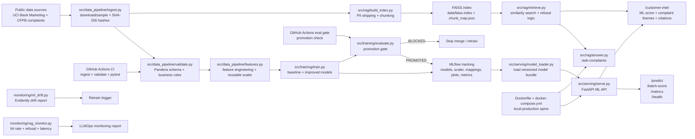

# Architecture

The system is built as two services sharing one production spine: the ML API scores campaign conversion, while the RAG API retrieves complaint evidence. MLflow, FAISS, CI, monitoring, and Docker Compose make the project reproducible from ingestion through demo.

